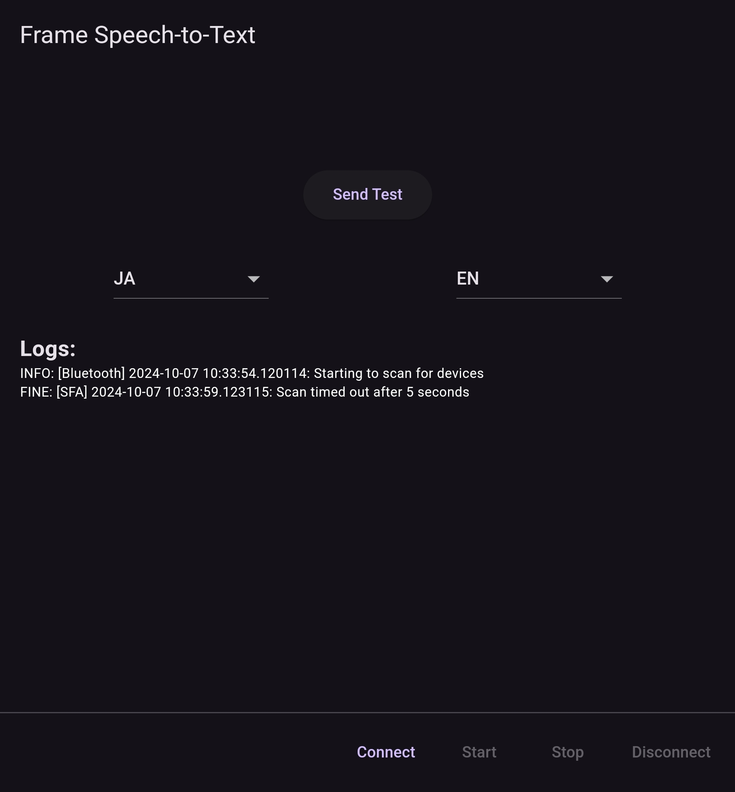

# Frame Libretranslate

Replace the Libretranslate Link & API KEY in main.dart...

languages = 
ar:Arabic
cs:Czech
da:Danish
de:German
el:Greek
en:English
es:Spanish
et:Estonian
fa:Persian
fi:Finnish
fr:French
hi:Hindi
it:Italian
ja:Japanese
ko:Korean
nb:Norwegian
pl:Polish
sq:Albanian
sv:Swedish
tr:Turkish
uk:Ukrainian
zh:Chinese(Simplified)
zt:Chinese(Traditional)

